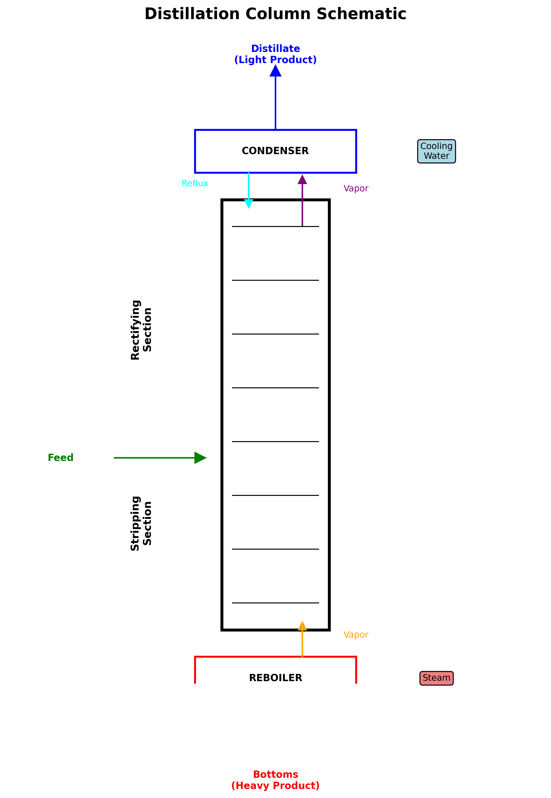

# Industrial Distillation Equipment and Design



*Figure 1: Distillation column schematic showing main components including condenser, reboiler, feed location, product streams, and internal tray structure*

## Column Internals Design

### Tray Selection and Design

#### Sieve Trays
**Design Parameters:**
- Hole diameter: 3-25 mm (typically 5-12 mm)
- Open area: 5-15% of active area
- Tray spacing: 0.3-1.0 m (typically 0.6 m)
- Weir height: 25-75 mm

**Applications:**
- General purpose distillation
- Low to moderate foaming systems
- Cost-effective solution

**Design Correlations:**
```
Weeping velocity: v_w = K_w × √(h_w/ρ_L)
Entrainment: e = 0.073 × (u_f)^2.5
```

#### Valve Trays
**Advantages:**
- Self-regulating vapor flow
- Wide operating range
- Good efficiency at varying loads

**Design Features:**
- Rectangular or round valve openings
- Valve weights for flow regulation
- Deflector caps for liquid contact

#### Bubble Cap Trays
**Characteristics:**
- Positive liquid contact
- Excellent turndown capability
- High pressure drop

**Applications:**
- Very low vapor rates
- High liquid rates
- Specialty applications

### Structured Packing Design

#### Corrugated Sheet Metal Packing

**Mellapak Series (Sulzer):**
- Surface area: 125-750 m²/m³
- Void fraction: 93-98%
- HETP: 0.2-1.0 m

**Montz-Pak Series (Montz):**
- Enhanced surface textures
- Improved liquid distribution
- Reduced pressure drop

**Flexipac Series (Koch-Glitsch):**
- Perforated corrugated sheets
- Enhanced mass transfer
- Higher capacity

#### Design Calculations

**Flooding Velocity:**
```
u_flood = C_flood × √[(ρ_L - ρ_V)/ρ_V]
```

**HETP Correlation:**
```
HETP = H_G + λ × H_L + H_diff
```

Where:
- H_G: Gas-phase height equivalent
- H_L: Liquid-phase height equivalent  
- H_diff: Diffusion contribution

#### Industry Standard Packing References

For detailed packing specifications and performance data, refer to:

- **[Sulzer Mellapak Product Guide](https://www.sulzer.com/en/products/separation-technology/structured-packings)** - Comprehensive technical data sheets for structured packings including HETP correlations and capacity charts
- **[Koch-Glitsch Mass Transfer Products](https://www.kochglitsch.com/products/mass-transfer)** - Technical bulletins for Flexipac structured packings and random packings
- **[Raschig Process Technology](https://www.raschig.com/products/mass-transfer)** - Performance data for Super-Ring and other random packings

### Random Packing Selection

#### Metal Random Packings

**Pall Rings:**
- Size range: 15-90 mm
- Surface area: 100-350 m²/m³
- Applications: General distillation

**Raschig Super-Ring:**
- Improved liquid spreading
- Reduced wall effects
- Higher efficiency

**IMTP (Intalox Metal Tower Packing):**
- Optimized geometry
- Low pressure drop
- High capacity

#### Ceramic and Plastic Packings
- Lower cost materials
- Corrosion resistance
- Temperature limitations

## Heat Exchanger Design

### Reboiler Selection and Design

#### Thermosiphon Reboilers
**Vertical Thermosiphon:**
- Natural circulation
- Low maintenance
- Suitable for clean services

**Horizontal Thermosiphon:**
- Higher heat transfer coefficients
- Compact design
- Better for viscous fluids

**Design Considerations:**
- Circulation ratio: 2-8
- Two-phase flow calculations
- Fouling allowances

#### Kettle Reboilers
**Advantages:**
- High heat transfer rates
- Good for high heat flux
- Positive liquid level control

**Design Features:**
- Shell-side vaporization
- Tube bundle design
- Vapor-liquid separation space

#### Forced Circulation Reboilers
**Applications:**
- Fouling services
- High viscosity fluids
- Crystallizing systems

**Components:**
- Centrifugal pump
- Heat exchanger
- Circulation piping

### Condenser Design

#### Total Condensers
**Shell-and-Tube Design:**
- Horizontal orientation
- Tube-side condensation
- Subcooling section

**Air-Cooled Condensers:**
- Reduced water consumption
- Plot space considerations
- Fan power requirements

#### Partial Condensers
**Applications:**
- Overhead vapor splitting
- Light component removal
- Energy optimization

**Design Challenges:**
- Two-phase flow distribution
- Temperature approach
- Control considerations

## Column Sizing and Hydraulics

### Diameter Calculations

#### Tray Columns
**Flooding Correlation (Fair):**
```
u_flood = K × √[(ρ_L - ρ_V)/ρ_V]
```

**Design Factor:**
- Operating velocity: 70-85% of flood velocity
- Flexibility considerations
- Future capacity requirements

#### Packed Columns
**Flooding Velocity:**
```
u_f = C_f × √[(ρ_L - ρ_V)/ρ_V] × (ε³/(1-ε))
```

**Pressure Drop:**
```
ΔP/Z = (β × u_g²) / (ε³ × ψ)
```

### Height Calculations

#### Tray Columns
- Number of theoretical stages
- Tray efficiency estimation
- Tray spacing selection
- Vapor/liquid disengagement

#### Packed Columns
- HETP determination
- Packing height calculation
- Redistributor requirements
- Support grid design

## Material Selection

### Metallurgy Considerations

#### Carbon Steel
**Applications:**
- Non-corrosive services
- Temperature < 450°C
- Cost-effective solution

**Limitations:**
- Corrosion susceptibility
- Stress corrosion cracking
- High-temperature limitations

#### Stainless Steel Grades

**304/304L Stainless Steel:**
- General corrosion resistance
- Temperature range: -200 to 800°C
- Chloride limitations

**316/316L Stainless Steel:**
- Enhanced corrosion resistance
- Marine environments
- Pharmaceutical applications

**Duplex Stainless Steels:**
- High strength applications
- Chloride resistance
- Stress corrosion cracking resistance

#### Specialty Alloys

**Inconel/Incoloy:**
- High-temperature applications
- Aggressive chemical environments
- Nuclear applications

**Hastelloy:**
- Extreme corrosion resistance
- High-temperature strength
- Chemical processing

### Corrosion Prevention

#### Coating Systems
- Epoxy coatings for water services
- Vinyl ester for acid services
- Fluoropolymer coatings

#### Cathodic Protection
- Impressed current systems
- Sacrificial anode systems
- Underground piping protection

## Safety and Environmental Considerations

### Pressure Relief Systems

#### Relief Valve Sizing
**API 521 Standard:**
- Fire case scenarios
- Blocked discharge scenarios
- Control system failures

**Relief Load Calculations:**
```
Q_fire = C × A^0.82 × F × (T_set + 460)^0.5
```

#### Flare System Design
- Knockout drum sizing
- Flare stack height calculations
- Radiation considerations
- Environmental compliance

### Leak Detection and Repair (LDAR)

#### Component Monitoring
- Valve packing leaks
- Pump seal leaks
- Flange connections
- Sampling connections

#### Emission Reduction
- Low-emission valve designs
- Mechanical seal upgrades
- Vapor recovery systems
- Process optimization

### Environmental Compliance

#### Air Emissions
- VOC reduction strategies
- HAP (Hazardous Air Pollutants) minimization
- Continuous emission monitoring
- Title V permitting

#### Water Discharge
- Wastewater treatment
- Stormwater management
- Groundwater protection
- Zero liquid discharge

## Instrumentation and Control

### Process Measurements

#### Temperature Measurement
**Thermocouple Types:**
- Type J: Iron-Constantan (-40 to 750°C)
- Type K: Chromel-Alumel (-200 to 1250°C)
- Type T: Copper-Constantan (-200 to 350°C)

**RTD (Resistance Temperature Detector):**
- Pt100: Platinum resistance element
- Higher accuracy than thermocouples
- Linear response characteristics

#### Pressure Measurement
**Pressure Transmitters:**
- Differential pressure
- Absolute pressure
- Gauge pressure

**Pressure Safety:**
- Pressure relief valves
- Rupture discs
- Pressure switches

#### Flow Measurement
**Orifice Plates:**
- Simple and reliable
- Pressure drop penalty
- Rangeability limitations

**Venturi Meters:**
- Low permanent pressure loss
- High accuracy
- Higher cost

**Coriolis Meters:**
- Direct mass flow measurement
- High accuracy
- Density measurement

#### Composition Measurement
**Gas Chromatography:**
- Multi-component analysis
- High accuracy
- Slow response time

**Infrared Analyzers:**
- Fast response
- Specific component detection
- Drift considerations

**Mass Spectrometry:**
- Real-time analysis
- Wide range capability
- High maintenance

### Control Strategies

#### Single Loop Control
**PID Controllers:**
- Proportional-Integral-Derivative
- Tuning parameters
- Performance monitoring

#### Advanced Control
**Model Predictive Control (MPC):**
- Multivariable control
- Constraint handling
- Economic optimization

**Feedforward Control:**
- Disturbance compensation
- Faster response
- Model requirements

#### Safety Instrumented Systems (SIS)
**Safety Integrity Levels (SIL):**
- SIL 1: Basic safety functions
- SIL 2: Standard chemical industry
- SIL 3: High-risk applications

## Maintenance and Reliability

### Predictive Maintenance

#### Vibration Monitoring
- Pump and compressor monitoring
- Bearing condition assessment
- Unbalance detection
- Misalignment identification

#### Thermography
- Hot spot detection
- Electrical connections
- Refractory inspection
- Heat exchanger fouling

#### Oil Analysis
- Wear metal detection
- Contamination monitoring
- Additive depletion
- Acid number trending

### Planned Maintenance

#### Turnaround Planning
- Scope development
- Resource allocation
- Critical path scheduling
- Risk assessment

#### Inspection Programs
- API 510: Pressure vessel inspection
- API 570: Piping inspection
- ASME Section VIII: Pressure vessel code
- API 653: Tank inspection

### Reliability Engineering

#### Failure Mode Analysis
- FMEA (Failure Mode and Effects Analysis)
- Root cause analysis
- Reliability block diagrams
- Fault tree analysis

#### Spare Parts Management
- Critical spare identification
- Inventory optimization
- Supplier qualification
- Emergency procurement

## References

1. Kister, H.Z. "Distillation Operation" McGraw-Hill, 1990
2. Ludwig, E.E. "Applied Process Design for Chemical and Petrochemical Plants" Gulf Professional Publishing, 2001
3. Stichlmair, J. & Fair, J.R. "Distillation: Principles and Practice" Wiley-VCH, 1998
4. API Standards: API 660 (Heat Exchangers), API 521 (Pressure Relief)
5. ASME Boiler and Pressure Vessel Code, Section VIII
6. TEMA Standards for Shell-and-Tube Heat Exchangers